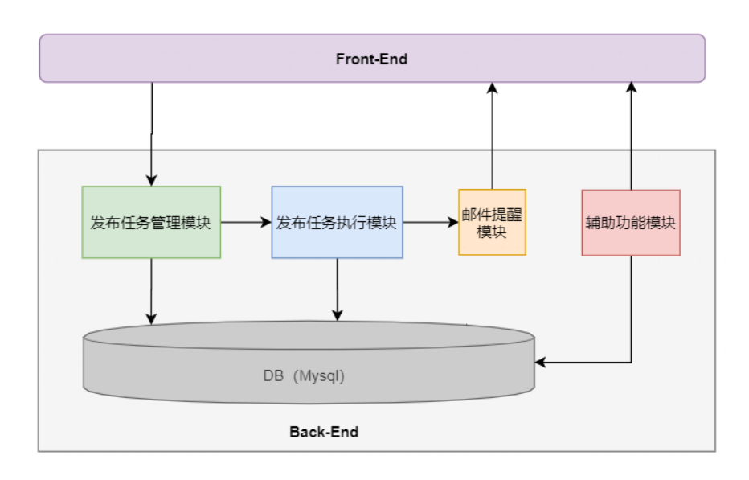
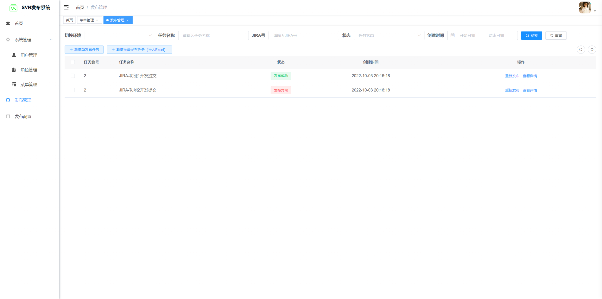
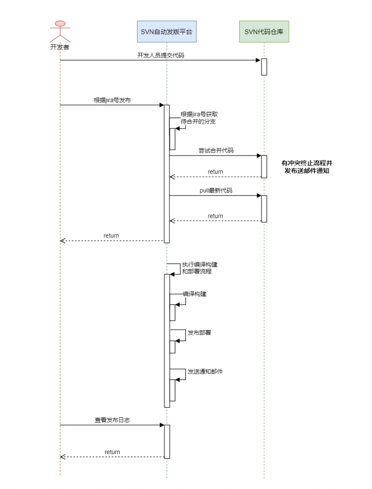
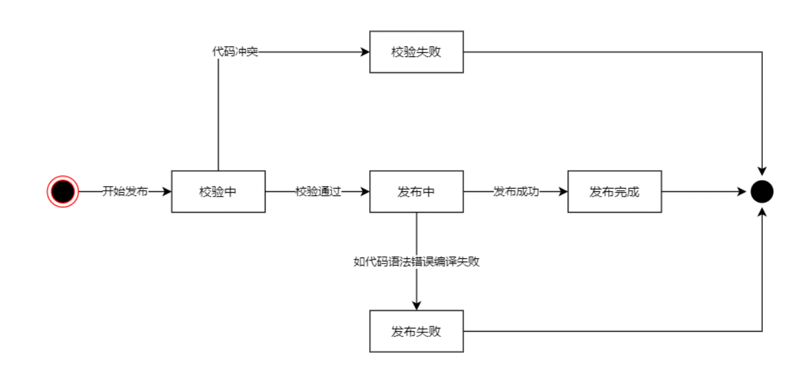

## SVN自动发版系统-实施方案
### 1. 项目概述
项目核心功能在于基于SVN根据提交记录实现自动发版功能。系统核心流程为发布版本，发布版本分为2种类型，一种为按照单个提交进行合并发版，第二个种为批次多个提交进行合并发版。以下进行核心功能点及辅助功能点逻辑。
### 2. 功能点罗列
   - 菜单管理（由于功能较少可配置固定菜单）
   - 发布环境环境切换 
     - dev
     - sit
     - release
   - 用户管理
     - 添加用户
     - 编辑用户权限
     - 删除用户
   - 角色管理
     - 添加角色
     - 编辑角色
     - 删除角色
   - 发布配置
     - 项目路径配置
     - 发布通知邮箱配置
   - 发布管理
     - 添加单提交发布任务
     - 添加批次提交发布任务（导入Excel）
     - 执行任务发布
     - 查看发布日志
     - 发布结果查看
     - 冲突邮件提醒
### 3. 系统设计
系统基于B/S架构，基础功能使用Java实现，采用前后端分离的方式开发。使用的技术栈罗列如下：
   - 后端技术
     - SpringBoot
     - Mybatis
     - SpringSecurity
     - Redis & Jwt
     - SVN操作使用SvnKit
     - DB使用MySQL
   - 前端技术
     - Vue（2.x）
     - ElementUI
#### 后端系统基础架构示意图

#### 前端UI示意图

#### 系统核心流程时序图

#### 系统发布任务状态机

### 4. 系统业务细则补充
  - SVN发版系统，需要push合并后的代码和编译输出文件到远程仓库
  - 当sql文件被删除时，将sql文件输出到目标路径时，也需要将已存在的同名sql文件删除
  - 表头放置一键发布按钮，选择要发布任务行，点击一键发布。
  - 关于DLL编译输出
    - 可以在发布任务上通过下拉列表多选，要输出的DLL文件
    - 下拉列表可选择的DLL文件名，可以在数据字典功能配置
    - 当选择多个任务一键发布时，输出的DLL为所有任务所选择的DLL并集
    - 如果是批量发布任务，每个任务单独合并-提交，当出现冲突时停止任务。当所有任务都合并完成最后执行编译逻辑。（任务状态：未合并、已合并、已编译）
  - 关于Excel导入任务与搜索
    - Excel导入，跳过N行（可做成配置化）
    - 任务增加，需求迭代周字段
    - 读取序号1所在行的【计划结束时间】字段作为迭代周，作为日期类型存储
    - 表头增加迭代周搜索条件（日期选择-只选到天）
    - 关于导入Excel列字段说明
      - jira号长度20个字符
      - 类型：只有开发(需求)
      - 名称：长度500个字符
      - 关联业务需求：长度500个字符【可以为空】
      - 负责人：系统内用户（导入时校验）
      - 备注：长度500个字符【可以为空】
  - 当导入活新增相同的jira号时，更新老的记录，老记录的发布数据仍然保留。
### 5. 数据库字典
#### 发布任务表：task_record
| 字段名 | 字段类型 | 允许为空 | 默认值 | 描述|
| --- | --- |----| --- | --- |
| id | bigint | 	否 | primary key | 主键 |
| jira_no | varchar(20) | 	否 | 无 | JIRA号 |
| demand_name | varchar(500) | 否  | 无 | 需求名称 |
| demand_type | tinyint | 	否 | 1-开发(需求) | 需求类型 |
| relate_demand | varchar(500) | 是  | '' | 关联业务需求 |
| principal | varchar(50) | 	否 | 无 | 负责人 |
| remark | varchar(500) | 	是 | '' | 备注 |
| iterate_week | date | 	否 | 无 | 需求迭代周 |
| out_dll | varchar(5000) | 否 | 输出DLL（多个文件以应为逗号隔开） |
| status | tinyint | 否  | 0 | 最近发布状态 |
| env | varchar(10) | 	否 | 任务所属环境 |
| create_time | datetime | 	否 | current_timestamp | 创建时间 |
| create_by | varchar(50) | 	否 | 创建人 |
| update_time | datetime | 	是 | 更新时间 |
| update_by | varchar(50) | 	是 | 更新人 |

#### 发布详情表：task_log
| 字段名 | 字段类型 | 允许为空 | 默认值 | 描述|
| --- | --- | --- | --- | --- |
| id | bigint|否|primary key|主键|
| task_id | bigint|否|发布任务Id|
| task_log | text|否|发布log日志|
| status | tinyint|否|0|任务发布状态|
| create_time | datetime|否|current_timestamp|创建时间|
| create_by | varchar(50)|否|创建人|
| update_time | datetime|是|更新时间|
| update_by | varchar(50)|是|更新人|
### 6. 需求方补充信息
  - xx
  - xx
